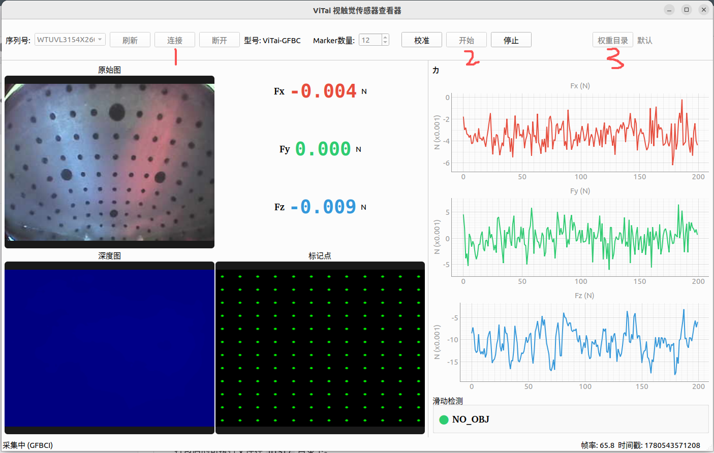

# ViTai Sensor Viewer

ViTai 视触觉传感器桌面查看器，基于 PyQt6 构建，支持实时查看传感器图像数据、力数据及滑动检测状态。

## Features

- 设备扫描与自动发现（USB）
- 实时多通道图像预览（矫正图、深度图、标记点图）
- 六维力（Fx/Fy/Fz/Mx/My/Mz）实时曲线图
- 滑动状态检测
- 传感器校准
- 自定义 ONNX 权重加载（按传感器 SN 匹配）
- 跨平台支持（Linux / Windows）

## Requirements

- Python 3.10+
- Linux x86_64 或 Windows x86_64
- ViTai 视触觉传感器硬件

## Quick Start

### 源码运行

```bash
# 1. 安装 SDK
pip install wheels/linux/pyvitaisdk4bc-1.0.9-py3-none-linux_x86_64.whl
# Windows:
# pip install wheels/windows/pyvitaisdk4bc-1.0.9-py3-none-win_amd64.whl

# 2. 安装依赖
pip install -r requirements.txt

# 3. 运行
python main.py
```

### 打包

```bash
python build.py
```

打包后的可执行文件在 `dist/` 目录下。

## 使用步骤



操作顺序按界面按钮编号执行：

**③ 权重目录（可选）** — 点击「权重目录」，选择包含自定义权重文件的目录。程序会按传感器 SN 自动匹配对应的 ONNX 权重。

```
BC_20260529_mini/
├── WTUVL2141X2600004/
│   ├── WTUVL2141X2600004.onnx.enc
│   └── normalization_params.json
└── WTUVL2141X2600003/
    └── ...
```

**① 连接** — 从序列号下拉框中选择传感器，点击「连接」。连接成功后自动开始采集，无需再点击「开始」。

**② 开始（停止后恢复）** — 如果按了「停止」，可点击「开始」重新采集，**无需重新连接**。

## Project Structure

```
sensor-desktop-app/
├── main.py                 # 程序入口
├── build.py                # 一键打包脚本（安装 SDK + 依赖 + PyInstaller 打包）
├── requirements.txt        # Python 依赖
├── ViTaiViewer.spec        # PyInstaller 打包配置
├── app/
│   ├── main_window.py      # 主窗口（UI 布局 + 信号连接 + 生命周期）
│   ├── sensor_worker.py    # 传感器采集工作线程
│   └── widgets/
│       ├── device_panel.py   # 顶部设备控制栏
│       ├── image_viewer.py   # 左侧图像显示区
│       └── data_panel.py     # 右侧数据面板（力曲线 + 滑动状态）
├── wheels/
│   ├── linux/              # Linux SDK wheel
│   └── windows/            # Windows SDK wheel
└── image.png               # 截图
```

## Troubleshooting

| 问题 | 解决方案 |
|------|---------|
| 传感器未识别 | 确认 USB 已连接，点击「刷新」按钮 |
| 画面卡顿 | 默认显示帧率 30fps，可修改 `main_window.py` 中 `display_freq` 参数 |
| 打包报错 `appdirs` | 已处理，确保 `build.py` 中包含 `--hidden-import appdirs` |
| 打包后 numpy 版本冲突 | 确保 numpy < 2.0，pyvitaisdk 依赖 `numpy<=1.26.4` |

## License

Internal use.
